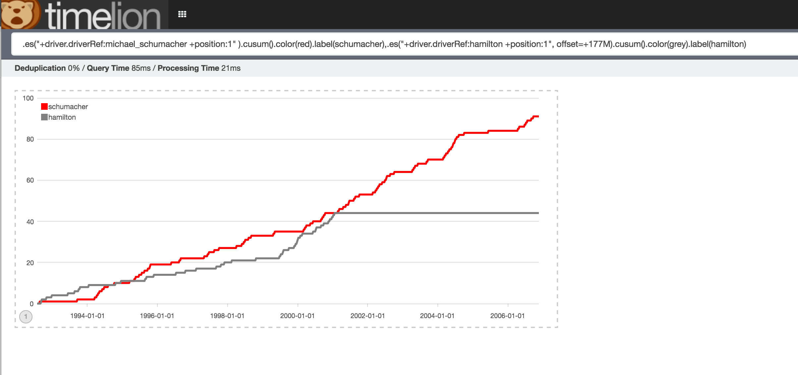

# ergast / ElasticSearch Data Loader

This is a **quick and dirty** data loader for [ergast](http://ergast.com/mrd/), Formula 1 database.


## Install 

You need to download and install [ergast dump](http://ergast.com/downloads/f1db.sql.gz) on MySQL 5.1 instance.

You also need to install [ElasticSearch](https://www.elastic.co/downloads/elasticsearch) and [Kibana](https://www.elastic.co/downloads/kibana) if you want to do some nice dataviz. You should also install [TimeLion](https://www.elastic.co/blog/timelion-timeline) if you want to do some timeseries-oriented DataViz.

To load data (you need JDK 8 installed) : 
    
    ./gradlew run
    
Wait for : 

    Data successuly loaded
    
And you are done !


## How does it work ?

Loader loads : 

    select *
    from results
    join status on results.statusid = status.statusid
    join drivers on results.driverid = drivers.driverid
    join races on results.raceid = races.raceid
    join circuits on races.circuitid = circuits.circuitid
    join constructors on results.constructorid = constructors.constructorid
    join seasons on races.year = seasons.year;
    
Into an ElasticSearch index (name `f1`), mapping is the following 

```javascript
    {
      "result": {
        "dynamic_templates": [
          {
            "strings": {
              "match_mapping_type": "string",
              "mapping": {
                "type": "string",
                "index": "not_analyzed",
                "ignore_above": 256
              }
            }
          }
        ],
        "properties" : {
          "circuit" : {
            "properties" : {
              "geopoint" : {
                "type": "geo_point"
              }
            }
          }
        }
      }
    }
```

## What do you want to do with it ?

I did some DataViz (sorry I do not know anything about Formula 1, this is actually a gift).

Season 2015 Dashboard : 


Schumacher vs Hamilton : 
